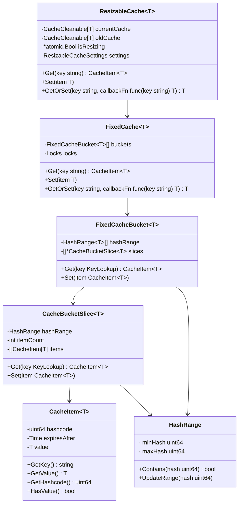

# Data structure

```mermaid
classDiagram
    class ResizableCache~T~ {
        -CacheCleanable[T] currentCache 
        -CacheCleanable[T] oldCache 
        -*atomic.Bool isResizing 
        -ResizableCacheSettings settings 

        +Get(key string) CacheItem~T~
        +Set(item T)
        +GetOrSet(key string, callbackFn func(key string) T) T
    }

    class FixedCache~T~ {
        -FixedCacheBucket~T~[] buckets
        -Locks locks
        +Get(key string) CacheItem~T~
        +Set(item T)
        +GetOrSet(key string, callbackFn func(key string) T) T
    }

    class FixedCacheBucket~T~ {
        -HashRange~T~[] hashRange
        -[]*CacheBucketSlice~T~ slices

        +Get(key KeyLookup) CacheItem~T~
        +Set(item CacheItem~T~)
    }

    class CacheBucketSlice~T~ {
        -HashRange hashRange 
        -int itemCount
        -[]CacheItem[T] items

        +Get(key KeyLookup) CacheItem~T~
        +Set(item CacheItem~T~)
    }

    class CacheItem~T~ {
        -uint64 hashcode 
        -Time expiresAfter 
        -T value

        +GetKey() string
        +GetValue() T
        +GetHashcode() uint64
        +HasValue() bool
    }

    class HashRange {
        - minHash uint64
        - maxHash uint64

        +Contains(hash uint64) bool
        +UpdateRange(hash uint64)
    }

    ResizableCache~T~ --> FixedCache~T~
    FixedCache~T~ --> FixedCacheBucket~T~
    FixedCacheBucket~T~ --> CacheBucketSlice~T~
    CacheBucketSlice~T~ --> CacheItem~T~
    CacheBucketSlice~T~ --> HashRange
     FixedCacheBucket~T~ --> HashRange
```

