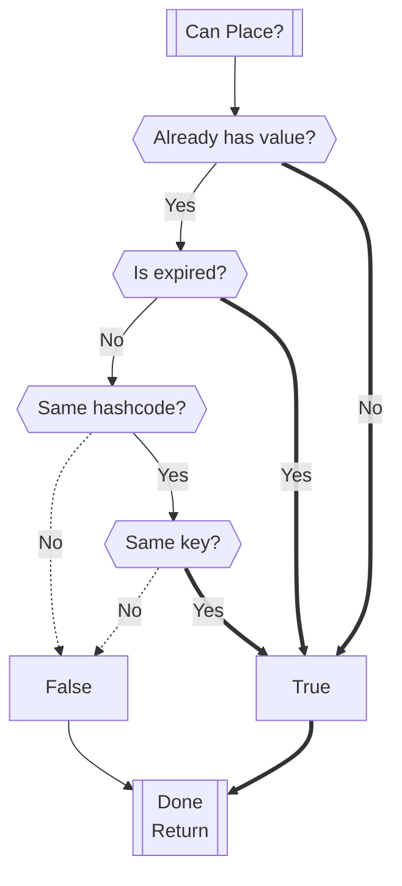
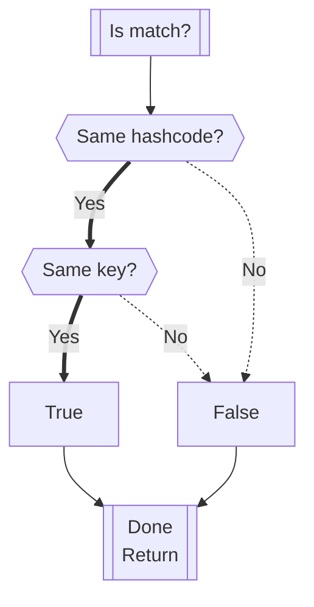

# CacheItem

- [CacheItem](#cacheitem)
  - [Can Place](#can-place)
  - [Is Match](#is-match)

## Can Place

```mermaid
graph
    canPlace[[Can Place?]]
    done[[Done</br>Return]]
    true[True]
    false[False]
    
    hasValue{{Already has value?}}
    isExpired{{Is expired?}}
    sameHashcode{{Same hashcode?}}
    sameKey{{Same key?}}

    canPlace --> hasValue

    hasValue-->|Yes|isExpired
    isExpired-->|No|sameHashcode
    sameHashcode-.->|No|false
    sameHashcode-->|Yes|sameKey

    sameKey-.->|No|false
    sameKey==>|Yes|true

    isExpired==>|Yes|true
    hasValue==>|No|true

    true==>done
    false-->done
```

## Is Match

```mermaid
graph
    isMatch[[Is match?]]
    sameHashcode{{Same hashcode?}}
    sameKey{{Same key?}}
    done[[Done</br>Return]]
    true[True]
    false[False]

    isMatch-->sameHashcode
    sameHashcode==>|Yes|sameKey
    sameKey==>|Yes|true

    sameHashcode-.->|No|false
    sameKey-.->|No|false

    true-->done
    false-->done
```